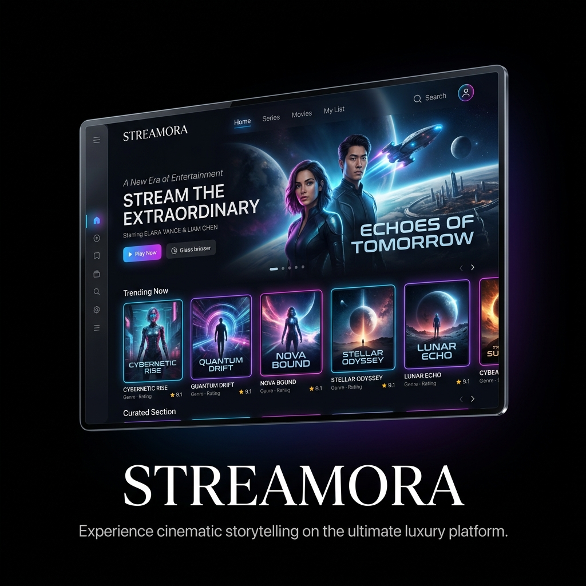

# 🎬 Streaming Platform - Netflix Clone


## 🌟 Project Overview
Welcome to the **Streaming Platform**, a premium, luxury-tier Netflix-like media streaming application. Designed with modern aesthetics, smooth performance, and high-quality user experience in mind, this application serves as a comprehensive full-stack showcase featuring a sophisticated Next.js frontend, a robust .NET 8 backend architecture, and a PostgreSQL database. From cinematic UI styling to personalized recommendations, this platform represents the pinnacle of modern web development and streaming technology.

## 🚀 Quick Start

### Option 1: Docker (Easiest)

```bash
# Start everything with one command
docker-compose up -d

# View logs
docker-compose logs -f
```

**Access:**
- Frontend: http://localhost:3000
- Backend API: http://localhost:5181
- Swagger: http://localhost:5181/swagger

### Option 2: Manual Setup

#### 1. Database Setup
```bash
# Create PostgreSQL database
psql -U postgres
CREATE DATABASE StreamingPlatformDB;
\q
```

#### 2. Backend
```bash
cd Backend/StreamingPlatform.API
dotnet restore
dotnet ef database update
dotnet run
```

#### 3. Frontend
```bash
cd frontend
npm install
npm run dev
```

## 📋 Prerequisites

- .NET 8 SDK
- Node.js 18+
- PostgreSQL 15+
- Docker Desktop (for Docker setup)

## 🎯 Features

- ✅ User Authentication (JWT)
- ✅ Content Management
- ✅ Watch History & Progress Tracking
- ✅ Watchlist/Favorites
- ✅ Personalized Recommendations
- ✅ Advanced Search & Filters
- ✅ Admin Dashboard
- ✅ Payment/Subscription (Stripe)
- ✅ Adaptive Video Streaming (HLS/DASH)
- ✅ Real-time Notifications (SignalR)
- ✅ AWS S3/CloudFront Integration

## 📁 Project Structure

```
StreamingPlatform/
├── Backend/              # .NET 8 API
│   └── StreamingPlatform.API/
├── frontend/             # Next.js Frontend
├── Dockerfile            # Backend Docker config
├── docker-compose.yml    # Full stack Docker setup
└── README.md
```

## 🔧 Configuration

### Backend
- Port: `5181`
- Database: PostgreSQL
- Config: `Backend/StreamingPlatform.API/appsettings.json`

### Frontend
- Port: `3000`
- API URL: `http://localhost:5181`
- Config: `frontend/.env.local`

## 📚 Documentation

- [Setup Guide](SETUP_GUIDE.md) - Detailed setup instructions
- [Implementation Summary](IMPLEMENTATION_SUMMARY.md) - Feature documentation

## 🛠️ Development

### Backend Commands
```bash
cd Backend/StreamingPlatform.API
dotnet restore          # Restore packages
dotnet ef database update  # Apply migrations
dotnet run              # Run API
```

### Frontend Commands
```bash
cd frontend
npm install     # Install dependencies
npm run dev     # Development server
npm run build   # Production build
npm start       # Production server
```

## 🐳 Docker Commands

```bash
docker-compose up -d        # Start all services
docker-compose down          # Stop all services
docker-compose logs -f       # View logs
docker-compose up -d --build # Rebuild and start
```

## 📝 API Endpoints

- **Auth**: `/api/Auth/login`, `/api/Auth/register`
- **Content**: `/api/content`
- **Watchlist**: `/api/watchlist`
- **Watch History**: `/api/watchhistory`
- **Recommendations**: `/api/recommendation`
- **Search**: `/api/search`
- **Admin**: `/api/admin/*`
- **Payment**: `/api/payment/*`

Full API documentation: http://localhost:5181/swagger

## 🎬 Usage

1. **Register/Login** - Create account or sign in
2. **Browse Content** - Explore movies and series
3. **Add to Watchlist** - Save favorites
4. **Watch Videos** - Stream with adaptive playback
5. **Get Recommendations** - Personalized suggestions
6. **Admin Panel** - Manage users and content (Admin role required)

## 🔐 Default Admin

To create an admin user:
1. Register normally
2. Update user role in database:
```sql
UPDATE "Users" SET "Role" = 'Admin' WHERE "Email" = 'your-email@example.com';
```

## 📞 Support

For issues or questions, check:
- Console logs
- Browser console (F12)
- Swagger UI for API testing

## 📄 License

This project is for educational purposes.

